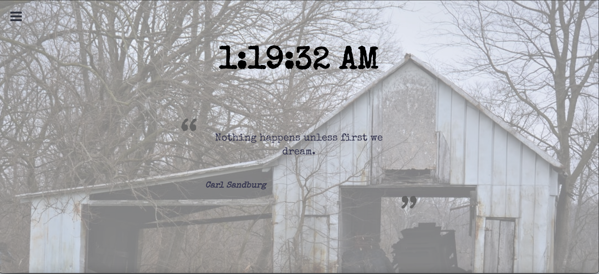
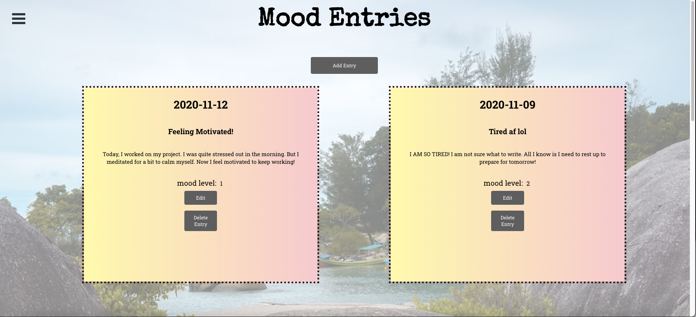
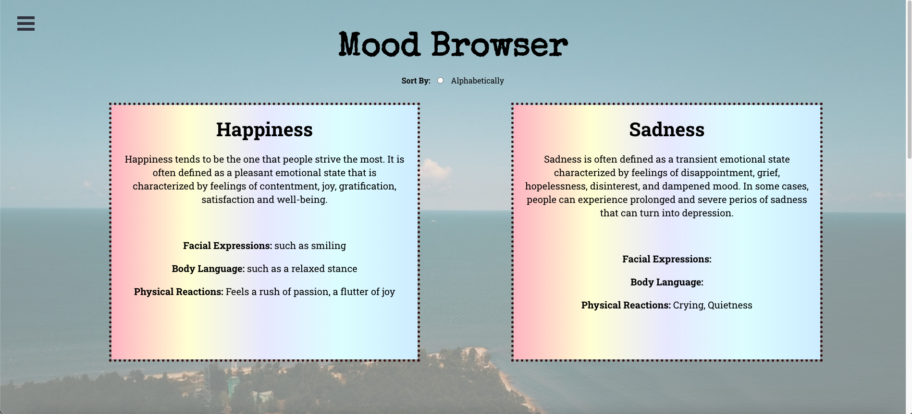

Mood Journal
=====================

## Objectives

This project is a mood journal to help log entries and moods for users.

<a href="https://moodjournal-client.herokuapp.com/" target="_blank">Demo</a>

---

## Motivation

We are living in a society with a lot of stress and distractions, sometimes we are unaware of our emotions that could possibly create some negative effects to our mental health. As mental health becomes a widely and openly discussed topic in our current society, we created this mood journal to enable users to record their moods and keep track of them. 

---

## Setup

- Clone this repo
- Run `npm i` to install all dependencies for this project
- Run `npm start` to start the server
- Backend has been deployed to Heroku. If you would like, you can checkout our backend repo that has attached below.

---

## Screenshots

### Home Page

### Mood Entries

### Add Mood Entries

(Apologize for the resolution)

### Mood Browsers

---

Technology Used:
- Front End: ReactJS
    - [External API](https://type.fit/api/quotes) + Axios to fetch and generate random quotes in Home Page
    - External API from [Unsplash](https://source.unsplash.com/featured/?rock,tree,nature,water) to generate random background images
- Backend + Database: [Ruby on Rails API](https://github.com/candacecodes/moodjournal) 
- CSS for styling 

---

## Created By

- [Candace Choe](https://github.com/candacecodes)
- [Megan Lo](https://github.com/mehmehmehlol)
